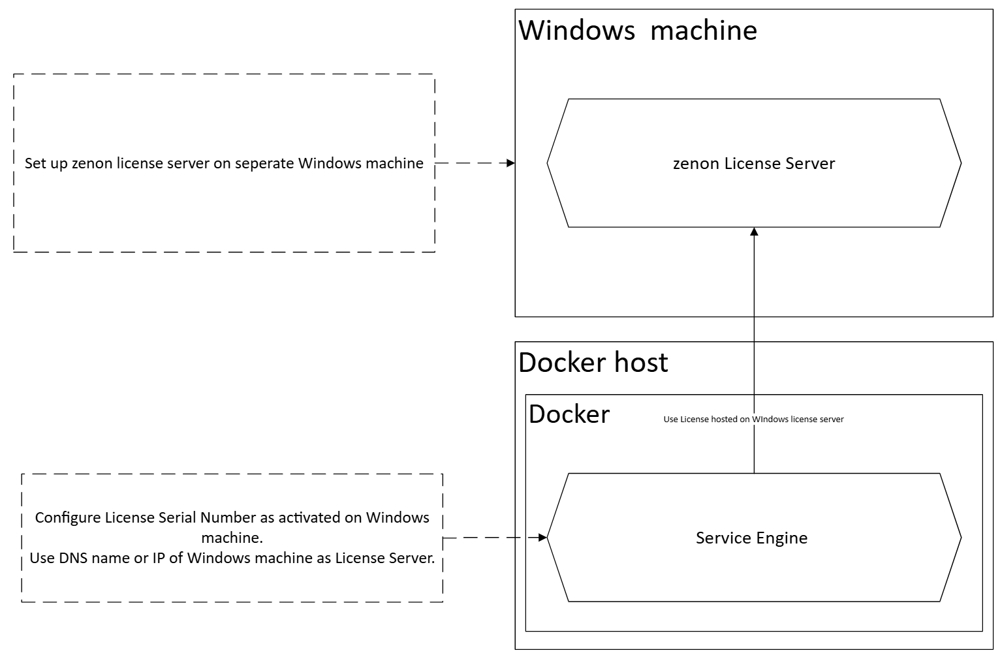
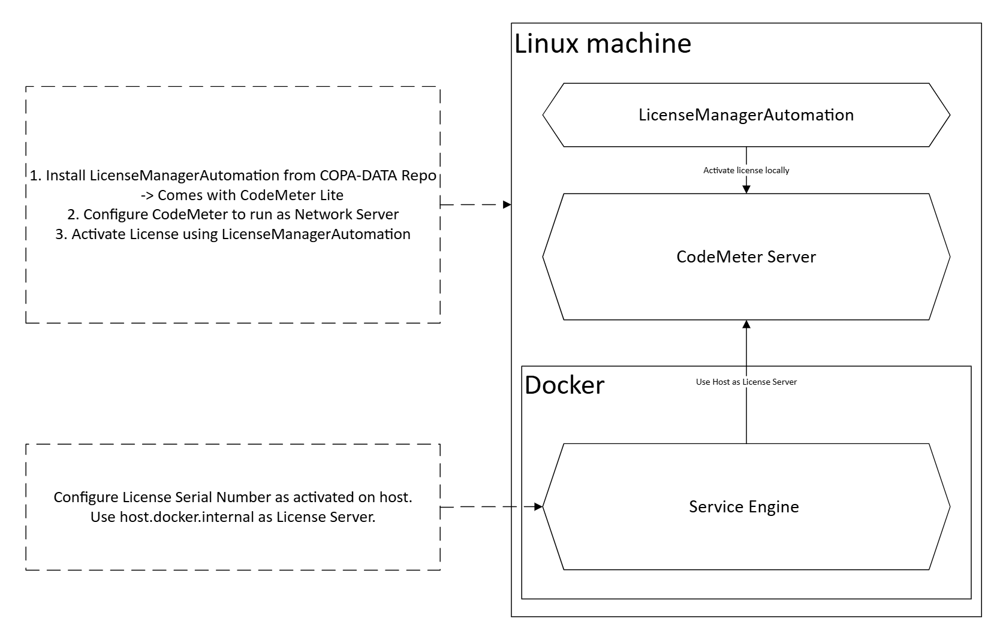

# Licensing of Service Engine running in Docker

## Windows License Server

A Windows based machine with the zenon License Manager installed and an available network license can be used to provide a license to the containerized Service Engine. This machine then acts as license server and the license will then be shared over the network. Therefore this machine must be accessible from the service-engine container in order to borrow a license.


If the Docker host machine is already running Windows, it can also be directly used to provide a license to the Service Engine container.


Just follow the [official zenon help](https://onlinehelp.copadata.com/) on how to install the License Manager and making licenses available in the Network.



## License Server on Host machine

When running the Service Engine container on a linux device, it is often not feasable to have a seperate Windows machine hosting the license.
To remove this need and enable standalone Linux machines running the Service Engine in a container, a Linux machine can also be used to provide the license to the conatiner.



### 1. Add COPA-DATA APT repository on the host machine

Carry out the following steps to set up the APT repository on the linux host machine:

1. Download the repository GPG key.
To do this, execute the following command:
wget -O- https://repository.copadata.com/zenon/14/release/copadata-archive-keyring.gpg.key | gpg --dearmor | sudo tee /usr/share/keyrings/copadata-archive-keyring.gpg > /dev/null

2. Add the APT repository to the list of remote repositories. Make sure that you are using the correct hardware for your Linux computer:
    - For computers with an amd64 processor, execute the following command:
    ```
    echo "deb [arch=amd64 signed-by=/usr/share/keyrings/copadata-archive-keyring.gpg] https://repository.copadata.com/zenon/14/release/ jammy main" | sudo tee /etc/apt/sources.list.d/copa-data.list
    ```
    - For computers with an arm64 processor, execute the following command:
    ```
    echo "deb [arch=arm64 signed-by=/usr/share/keyrings/copadata-archive-keyring.gpg] https://repository.copadata.com/zenon/14/release/ bullseye main" | sudo tee /etc/apt/sources.list.d/copa-data.list
    ```

3. Update the local index file for the repository.  
    To do this, execute the following command:
    ```
    sudo apt update
    ```

### 2. Install licensing-manager-automation

1. Install .NET according to Microsofts Instruction.  
COPA-DATA recommends the "scripted install" method found [here](https://learn.microsoft.com/en-us/dotnet/core/install/linux-scripted-manual#scripted-install).

2. Install licensing-manager-automation from the COPA-DATA package feed by using the following command:
    ```
    sudo apt install licensing-manager-automation
    ```

### 3. Enable CodeMeter to act as a license Server

In order for the service-engine in the container to obtain a license that is activated on the host machine, the license server on the host must be enabled to share it's licenses on the network.
1. Stop CodeMeter Services 
    ```
    /etc/init.d/codemeter stop
    ```
2. Edit the Server.ini file under /etc/wibu/CodeMeter/Server.ini
3. Change IsNetworkServer=0 to IsNetworkServer=1 in the "General" section
4. Start the Codemeter service again
    ```
    /etc/init.d/codemeter start
    ```


### 4. Activate a license

Now the zenon license can be activated on the host machine using the installed LicenseManagerAutomation.  
Use the command `LicenseManagerAutomation` to see arguments and samples.


E.g. Activating a Soft-License with serial number "C00WU-Z5SVK-UCGC2-00000-01633" on the host:
```
LicenseManagerAutomation --action ActivateOnline --SerialNumber C00WU-Z5SVK-UCGC2-00000-01633 --DongleType Soft
```

### 5. Use the license in the Service Engine container

to use the license activated on the host with the service engine container, configure it in the .env file of the service-engine docker-compose package:
```
RUNTIME_LICENSE_SERIAL=C00WU-Z5SVK-UCGC2-00000-01633
RUNTIME_LICENSE_SERVER=host.docker.internal

PROCESSGATEWAY_LICENSE_SERIAL=C00WU-Z5SVK-UCGC2-00000-01633
PROCESSGATEWAY_LICENSE_SERVER=host.docker.internal

LOGIC_LICENSE_SERIAL=C00WU-Z5SVK-UCGC2-00000-01633
LOGIC_LICENSE_SERVER=host.docker.internal
```